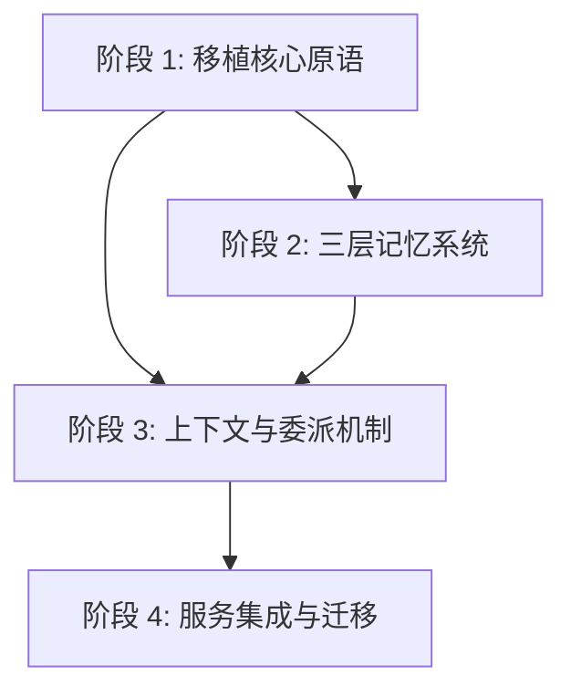

# Lotus-DB Agent 重构执行指南 (v2.1)

本指南旨在将 **Lotus-DB** 的 Agent 模块重构为类 **Nanobot/Claude Code** 的架构。
**核心原则**：
1.  **复用优先**：直接移植 Nanobot 的核心组件 (`loop`, `registry`, `provider`, `context`)，仅做必要的适配。**特别注意**：Lotus-DB 是单体 Web 架构，必须剔除 Nanobot 的 MessageBus 相关冗余代码。
2.  **旁路开发**：所有新代码在 `src/agent` 目录下开发。
3.  **去 LangGraph 化**：完全移除 LangGraph，使用移植过来的 `AgentLoop`。
4.  **大胆重构**：不考虑旧数据兼容性，不考虑旧 Service 接口兼容性。

---

# 📅 阶段依赖图 (DAG)

---

# 阶段 1: 移植核心原语 (Port Core Primitives)

**目标**：从 Nanobot 移植核心骨架，建立可运行的 Agent 循环。

## 验收清单
- [ ] `AgentConfig` 定义符合《智能体设计更新指南》。
- [ ] 消息模型、请求上下文、流式事件协议已在 P1-S01 固化为单一真源。
- [ ] `ToolRegistry` 成功移植自 Nanobot 并能注册工具。
- [ ] `LLMClient` 成功移植自 Nanobot `litellm_provider` (或简化版)。
- [ ] `AgentLoop` 成功移植自 Nanobot 并能跑通基础对话。

### 步骤详情

| Step ID | 目标 | 涉及文件 | 具体操作 | 验证方式 | 回滚方案 |
| :--- | :--- | :--- | :--- | :--- | :--- |
| **P1-S01** | 定义 Agent 配置与基础协议 | `src/agent/config.py` `src/agent/types.py` | 1. 参考《智能体设计更新指南》定义 `AgentConfig` (含 `role`, `goal`, `allowed_tools`, `memory_access`, `max_iterations`, `can_delegate` 等)。 2. 定义 `AgentRole` 枚举、`AgentResult`。 3. 定义消息模型 `Message`、`ToolCall`（对齐 OpenAI tools 关键字段）。 4. 定义 `ConversationHistory`（纯内存版）：`add(...)` / `get_recent(...)` / `to_llm_messages(...)`。 5. 定义 `RequestContext`：`user_id`、`session_id`、`trace_id`。其中 `session_id` 在 API 层对应现有 `thread_id`。 6. 定义统一的 `StreamEvent` 协议，并明确传输层：标准 SSE（`text/event-stream`），使用 `event:` + `data:` 编码事件与载荷。 | 单元测试：1) Config 初始化字段齐全；2) ConversationHistory 基本行为正确；3) StreamEvent 可 JSON 序列化。 | 删除文件 |
| **P1-S02** | 移植工具注册表 | `src/agent/tools/registry.py` `src/agent/tools/base.py` | 1. 复制 Nanobot `agent/tools/registry.py`。 2. 适配 `ToolDefinition` 以支持 Lotus-DB 需要的字段 (如 `category`, `requires_confirmation`)。 3. 保留 Nanobot 的参数校验和 schema 生成逻辑。 | 注册一个 Mock 工具，验证 `get_tool_schemas` 输出符合 OpenAI 规范。 | 删除文件 |
| **P1-S03** | 移植 LLM Provider | `src/agent/llm/provider.py` | 1. 参考 Nanobot `providers/litellm_provider.py`。 2. 实现 `LLMClient`，封装 `chat` 和 `stream` 接口。 3. 保留 Nanobot 的重试机制和消息清洗逻辑。 | 1. 单元测试：使用 FakeLLM 验证 tool_calls 解析和错误处理。 2. (可选) 手工冒烟：配置真实 Key 验证连通性。 | 删除文件 |
| **P1-S03a** | 实现 Token 级流式输出 | `src/agent/llm/provider.py` | 1. 新增 `chat_stream` 方法支持 Token/Delta 级流式输出。 2. 输出事件对齐 `StreamEvent`：LLM 侧只负责产出 `text_delta`（必要时附带 usage），不直接绑定 HTTP/SSE。 | 单元测试：验证流式输出能正确生成 delta 序列。 | 回退代码 |
| **P1-S04** | 移植 Agent Loop（含流式与错误策略） | `src/agent/loop.py` | 1. **仅移植** Nanobot `agent/loop.py` 中的核心迭代逻辑，**剥离** MessageBus/Channels/MCP 依赖。 2. 替代方案：AgentLoop 以 `AsyncGenerator[StreamEvent, None]` 作为事件出口（UI/HTTP 由 Service 层适配）。 3. 工具执行：直接调用 `ToolRegistry.execute(name, args, ctx=RequestContext)` 返回字符串结果；工具异常不抛出到外层，转为 `tool_end` + `error` 事件，并作为 tool message 回注入 LLM。 4. 循环检测：连续 3 次同一工具调用 -> 注入反思 prompt（system message）。 5. 安全边界：`max_iterations` 硬上限；超限生成可解释的兜底回答并 `done`。 6. 错误处理策略（必须落地为可测试逻辑）：    - `llm_timeout`：重试 2 次（2s/4s），仍失败则产出 `error` 并结束。    - `llm_rate_limit`：尊重 `Retry-After`（若无则指数退避），重试后仍失败则结束。    - `tool_exception`：产出简短错误摘要作为 tool result 返回给 LLM（不包含敏感信息）。    - `token_overflow`：简单截断最早的消息后重试；仍失败则结束。 | 运行 Loop（无工具），输入 "Hello"，验证能返回 LLM 响应；运行 Loop（有工具），验证 tool_start/tool_end 事件顺序正确。 | 删除文件 |
| **P1-S05** | 适配现有核心工具 | `src/agent/tools/xxx_tools.py` | 1. 将 `src/agent/tools` 下的 `list_movies` 等工具包装为新的 `ToolDefinition`。 2. 注册到新 Registry 中。 3. 所有需要 user_id/session_id 的工具统一从 `RequestContext` 读取，不允许依赖 LangGraph 注入。 | 单元测试：验证 Registry 能正确加载并执行这些工具（含 ctx 注入）。 | 删除文件 |

---

# 阶段 2: 三层记忆系统 (The Brain)

**目标**：实现“Agent-用户-会话”三层记忆架构。

## 验收清单
- [ ] 记忆项能正确写入存储 (Mongo/Lance)。
- [ ] 语义检索能根据 Query 返回相关记忆。
- [ ] 冲突解决器能处理记忆冲突。

### 步骤详情

| Step ID | 目标 | 涉及文件 | 具体操作 | 验证方式 | 回滚方案 |
| :--- | :--- | :--- | :--- | :--- | :--- |
| **P2-S01** | 定义记忆模型与存储门面 | `src/agent/memory/models.py` `src/agent/memory/store.py` | 1. 定义 `MemoryItem` (参考《长期记忆优化指南》)。 2. 实现 `MemoryStoreFacade`。 3. 实现 **双写模式 (Double Write)**：`add` 方法同时写入 Mongo (元数据) 和 LanceDB (向量)，暂不引入异步 ChangeStream 同步以降低基础设施依赖。 | 写入一条记忆，验证 Mongo 中有元数据，LanceDB 中有向量。 | 回退代码 |
| **P2-S02** | 实现记忆检索器 | `src/agent/memory/retriever.py` | 1. 实现 `retrieve_for_context`。 2. 逻辑：Session (Mongo) + User (Vector TopK) + Agent (Vector)。 3. 简单的打分排序。 | 模拟 Query，验证返回的记忆包含预期的 User/Agent 记忆项。 | 回退代码 |
| **P2-S03** | 实现提取管道 | `src/agent/memory/extraction.py` | 1. 实现 `ExtractionPipeline`。 2. 定义提取 Prompt。 3. 异步触发 LLM 提取结构化记忆。 | 输入对话片段，验证能提取出 JSON 格式的偏好。 | 回退代码 |
| **P2-S04** | 实现冲突解决 | `src/agent/memory/conflict.py` | 1. 实现 `ConflictResolver`。 2. 逻辑：检索相似 -> LLM 判断 -> 更新/取代。 3. 实现 `SUPERSEDED` 状态流转。 | 构造冲突记忆，验证旧记忆被标记为 `SUPERSEDED`。 | 回退代码 |

---

# 阶段 3: 上下文与委派机制 (Context & Delegation)

**目标**：移植 Nanobot 的上下文管理和子 Agent 机制。

## 验收清单
- [ ] 上下文组装器能正确管理 Token 预算。
- [ ] `delegate` 工具能启动子 Agent。

### 步骤详情

| Step ID | 目标 | 涉及文件 | 具体操作 | 验证方式 | 回滚方案 |
| :--- | :--- | :--- | :--- | :--- | :--- |
| **P3-S01** | 移植上下文组装器骨架 | `src/agent/context/assembler.py` | 1. 参考 Nanobot `agent/context.py`，实现 ContextAssembler 的基础拼装流程。 2. 引入 `ContextBudget` 与按角色的 budget preset（主/子 agent 不同预算）。 3. 明确上下文分区：system core / memory / conversation / tool results / working reserve。 | 构造中等长度 Context，验证分区拼装顺序稳定且输出可被 LLMClient 接收。 | 删除文件 |
| **P3-S01a** | 实现 ProgressiveSummarizer | `src/agent/context/summarizer.py` | 1. 实现渐进式摘要：每 N 轮更新 running summary。 2. 摘要输入包含旧对话与关键工具结果；输出为可回注入的系统消息或摘要消息。 | 单元测试：每 N 轮触发摘要；摘要随新内容逐步更新。 | 删除文件 |
| **P3-S01b** | 集成摘要到预算裁剪 | `src/agent/context/assembler.py` | 1. 当任一分区超预算时，优先用 ProgressiveSummarizer 压缩旧内容，而不是直接截断。 2. 强约束：最近 3 轮对话必须完整保留。 | 构造超长 Context，验证组装后的 token 数在限制内，且最近 3 轮对话完整保留。 | 回退代码 |
| **P3-S02** | 移植子 Agent 机制 | `src/agent/delegation.py` | 1. 参考 Nanobot `agent/subagent.py`。 2. 实现 `DelegationHandler`。 3. 确保子 Agent 拥有独立的 `AgentLoop` 和受限的上下文/工具。 | 单元测试：Handler 能启动新 Loop 并返回结果。 | 删除文件 |
| **P3-S03** | 集成上下文与委派到 Loop | `src/agent/loop.py` | 1. 在 `AgentLoop` 中集成 `ContextAssembler`。 2. 在 `_execute_tool` 中拦截 `delegate` 调用，转发给 `DelegationHandler`。 | 集成测试：Prompt "帮我研究X"，验证触发了委派逻辑。 | 回退代码 |

---

# 阶段 4: 服务集成与迁移 (Integration & Migration)

**目标**：替换旧 Agent，重写 Service 层。

## 验收清单
- [ ] 新 API 端点 `/chat` 可用。
- [ ] 会话历史可持久化 (Mongo)。
- [ ] 端到端流程跑通。

### 步骤详情

| Step ID | 目标 | 涉及文件 | 具体操作 | 验证方式 | 回滚方案 |
| :--- | :--- | :--- | :--- | :--- | :--- |
| **P4-S01** | 实现会话持久化 | `src/agent/session.py` | 1. 参考 Nanobot `session/manager.py`。 2. 实现基于 Mongo 的简单 Session Manager (Load/Save history)。 3. **替代** 原有的 LangGraph Checkpointer。 | 存取一个 Session，验证消息历史被正确保存。 | 删除文件 |
| **P4-S02** | 重构 Agent Service | `src/services/llm/agent_service_v2.py` | 1. 创建新 Service。 2. 编排 `SessionManager` -> `AgentLoop` -> `StreamEvent`。 3. 传输层使用标准 SSE：`Content-Type: text/event-stream; charset=utf-8`，事件用 `event:` 指定类型、`data:` 承载 JSON。最少支持 `id` 与 `text_delta`；工具/错误事件按需扩展。 | 单元测试 Service 的 chat 方法。 | 删除文件 |
| **P4-S03** | 切换 API 路由 | `src/services/llm/llm_service.py` | 1. 修改 `/chat` 路由，接入 `AgentServiceV2`。 2. 废弃旧的 `LotusDBAgent` 调用。 3. **注意**：旧 API 参数可能需要适配，或者直接报错。 | 启动服务，通过 Postman 调用 `/chat`，验证新 Agent 响应。 | 回退代码 |
| **P4-S04** | 端到端验收场景 | 全局 | 以《验收标准与测试用例》为准，至少覆盖以下场景：  \\| 场景 \\| 输入 \\| 预期行为 \\| 验证点 \\| \\|------\\|------\\|----------\\|--------\\| \\| 基础对话 \\| "你好" \\| Agent 正常回复 \\| `/chat/stream` 返回 `text/event-stream`，并输出 `event: id` + 若干 `event: text` \\| \\| 工具调用 \\| "搜索周杰伦的歌" \\| 调用 `search_media` \\| 事件流包含 `event: tool_start/tool_end`，最终文本包含结果摘要 \\| \\| 多轮记忆 \\| 第1轮："我喜欢爵士乐" 第2轮："推荐一些音乐" \\| 推荐基于爵士偏好 \\| 记忆存储中出现偏好项，后续检索可命中 \\| \\| 委派 \\| "帮我深入研究X" \\| 触发子 Agent \\| 事件流出现 delegation 相关 tool 调用，最终汇总输出 \\| \\| 上下文溢出 \\| 连续 20 轮对话 \\| 触发摘要压缩 \\| 组装后的 token 数不超过预算，最近 3 轮完整保留 \\| \\| 会话恢复 \\| 重启服务后继续对话 \\| 历史从 Mongo 加载 \\| thread_id 对应会话历史可复现 \\| | 通过脚本或前端调用 `/chat` 与 `/chat/stream` 完整跑通上述表格。 | 修复 Bug |
| **P4-S05** | 清理 | `src/agent/*` | 1. 移除所有对旧模块的引用。 2. 归档旧代码 (重命名为 `src/agent_legacy`) 而非直接删除。 | 确认无代码引用旧模块。 | 恢复路由指向 |

---

# 阶段 5: Agent 系统优化 (System Optimization)

**目标**：优化性能、可维护性与可靠性，完成关键优化项。

## 验收清单
- [ ] 对话存储设计优化已落地并可验证。
- [ ] 旧代码冗余剔除完成。
- [ ] 委派机制完成并发化验证与优化。
- [ ] 上下文管理代码可读性显著提升。
- [ ] 记忆接入完成且具备端到端验证。
- [ ] 记忆双端存储复用同步逻辑。
- [ ] 工具循环检测优化完成。
- [ ] 工具错误处理与结构化响应对齐。
- [ ] 工具与记忆压缩策略清晰拆分。
- [ ] 记忆主动加载策略可用。

### 步骤详情

| Step ID | 目标 | 涉及文件 | 具体操作 | 验证方式 | 回滚方案 |
| :--- | :--- | :--- | :--- | :--- | :--- |
| **P5-S01** | 对话存储设计优化 | `src/agent/doc/Agent 优化 v1.md` | 参照 `Agent 优化 v1.md#L3-39` 的分层存储方案，拆分会话元数据与完整消息列表。（已完成） | 通过历史列表查询仅读取元数据文档。 | 回退存储模型 |
| **P5-S02** | 旧代码冗余剔除 | `src/agent/doc/Agent 优化 v1.md` `src/services/llm/agent_service_v2.py` `src/services/llm/llm_service.py` | 参照 `Agent 优化 v1.md#L90-97`，去除新旧服务冗余与重复接口。（已完成） | 对比依赖关系，无重复服务调用链。 | 恢复旧服务 |
| **P5-S03** | 委派机制并发优化 | `src/agent/delegation.py` | 验证当前委派机制是否为串行的 Fake 并发；若确认，考虑用 `subprocess` 实现线程级并发。 | 对比并发执行耗时与日志顺序。 | 回退串行实现 |
| **P5-S04** | 上下文管理可读性优化 | `src/agent/context/assembler.py` `src/agent/context/summarizer.py` | 重构上下文拼装流程，提升命名一致性与逻辑可读性。 | 代码审查可读性提升，功能不回退。 | 回退重构 |
| **P5-S05** | 记忆接入与端到端验证 | `src/agent/memory/*` | 记忆接入已完成，但缺乏端到端真实验证。（已完成，待验证） | 运行真实对话用例验证记忆写入与检索。 | 回退记忆接入 |
| **P5-S06** | 记忆双端存储复用同步 | `src/services/sync/base_sync_service.py` `src/agent/memory/store.py` | 复用已有 Mongo → LanceDB 同步逻辑，避免重复实现。 | 写入记忆后双端数据一致。 | 回退双写模式 |
| **P5-S07** | 工具循环检测优化 | `src/agent/doc/Agent 优化 v1.md` | 参照 `Agent 优化 v1.md#L255-255` 完成工具循环检测优化。（已完成） | 模拟循环调用并触发检测。 | 回退检测逻辑 |
| **P5-S08** | 工具错误处理对齐 | `src/agent/doc/Agent 优化 v1.md` `src/agent/types.py` | 对齐 `ToolResponse` 结构化返回，避免使用字符串前缀判断。（应已完成，需确认） | 返回结构化错误并可被 LLM 解析。 | 回退错误处理 |
| **P5-S09** | 工具与记忆压缩拆分 | `src/agent/doc/Agent 优化 v1.md` `src/agent/context/*` | 根据 `Agent 优化 v1.md#L338-340`，拆分工具压缩与记忆压缩逻辑。 | 工具与记忆压缩策略互不影响。 | 回退统一压缩 |
| **P5-S10** | 记忆主动加载策略 | `src/agent/memory/retriever.py` `src/agent/loop.py` | 为 Agent 提供主动获取记忆的函数，支持对话中按需检索。 | 触发主动检索并注入上下文。 | 回退被动加载 |

---

# 📋 项目管理 (Project Management)

为了确保跨多次对话的开发连续性，请 Agent 在每次对话结束时维护 `src/agent/doc/pm/` 目录下的项目管理文件。

## 文件说明

1.  **全局进度看板 (`src/agent/doc/pm/progress_board.md`)**
    *   **用途**: 跟踪所有阶段和步骤的完成状态。
    *   **操作**: 每次完成一个 Step，将对应的 `[ ]` 改为 `[x]`。

2.  **当前步骤详情 (`src/agent/doc/pm/current_step.md`)**
    *   **用途**: 记录正在进行的步骤的详细上下文。
    *   **操作**: 开始新步骤时填写目标和计划；步骤进行中更新进度笔记；步骤完成时清空或更新为下一个步骤。

3.  **变更日志 (`src/agent/doc/pm/changelog.md`)**
    *   **用途**: 记录每次对话的主要变更。
    *   **操作**: 每次对话结束前追加一条带日期的日志。

4.  **新对话启动上下文 (`src/agent/doc/pm/context.md`)**
    *   **用途**: 为下一个 Agent 提供“交接棒”。
    *   **操作**: 每次对话结束前更新，总结当前状态、关键决策和下一步指令。

5.  **对话交接模板 (`src/agent/doc/pm/handover_template.md`)**
    *   **用途**: 用于生成最终回复的模板。
    *   **操作**: 每次对话结束时，参考此模板生成最终回复给用户。

## Agent 行为规范

*   **启动时**: 首先读取 `context.md` 和 `current_step.md` 以恢复上下文。
*   **执行中**: 根据 `progress_board.md` 确定下一个任务。
*   **结束时**:
    1.  更新 `progress_board.md` (如果完成了步骤)。
    2.  更新 `changelog.md`。
    3.  更新 `context.md`。
    4.  输出基于 `handover_template.md` 的最终回复。
