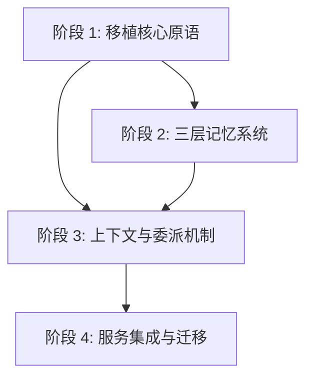

# Lotus-DB Agent 重构执行总结报告

## 项目概述

本重构项目旨在将 Lotus-DB 的 Agent 模块从 LangGraph 架构迁移到类 Nanobot/Claude Code 架构，遵循四大核心原则：
1. **复用优先** - 直接移植 Nanobot 核心组件，剔除 MessageBus 冗余
2. **旁路开发** - 所有新代码在 `src/agent` 目录开发
3. **去 LangGraph 化** - 完全移除 LangGraph 依赖
4. **大胆重构** - 不考虑旧数据和服务接口兼容性

## 阶段依赖关系

---

## 阶段 1: 移植核心原语 (Port Core Primitives)

### 目标
从 Nanobot 移植核心骨架，建立可运行的 Agent 循环

### 实现步骤详情

#### P1-S01: 定义 Agent 配置与基础协议
**涉及文件**: `config.py`, `types.py`
**实现方式**: 
- 定义 `AgentConfig` 包含 role, goal, allowed_tools, memory_access, max_iterations, can_delegate
- 定义 `AgentRole` 枚举和 `AgentResult`
- 定义消息模型 `Message` 和 `ToolCall`（对齐 OpenAI tools）
- 实现内存版 `ConversationHistory` 的 add/get_recent/to_llm_messages 方法
- 定义 `RequestContext` 包含 user_id, session_id, trace_id
- 制定统一 `StreamEvent` 协议，使用标准 SSE 格式
**验证方式**: 单元测试 Config 初始化、ConversationHistory 行为、StreamEvent 序列化

#### P1-S02: 移植工具注册表
**涉及文件**: `tools/registry.py`, `tools/base.py`
**实现方式**:
- 复制 Nanobot 的 `agent/tools/registry.py`
- 适配 `ToolDefinition` 支持 Lotus-DB 特有字段（category, requires_confirmation）
- 保留 Nanobot 的参数校验和 schema 生成逻辑
**验证方式**: 注册 Mock 工具，验证 `get_tool_schemas` 输出符合 OpenAI 规范

#### P1-S03: 移植 LLM Provider
**涉及文件**: `llm/provider.py`
**实现方式**:
- 参考 Nanobot `providers/litellm_provider.py`
- 实现 `LLMClient` 封装 chat 和 stream 接口
- 保留重试机制和消息清洗逻辑
**验证方式**: 单元测试使用 FakeLLM 验证 tool_calls 解析和错误处理

#### P1-S03a: 实现 Token 级流式输出
**涉及文件**: `llm/provider.py`
**实现方式**:
- 新增 `chat_stream` 方法支持 Token/Delta 级流式输出
- 输出事件对齐 `StreamEvent` 协议
**验证方式**: 单元测试验证流式输出能正确生成 delta 序列

#### P1-S04: 移植 Agent Loop（含流式与错误策略）
**涉及文件**: `loop.py`
**实现方式**:
- 仅移植 Nanobot `agent/loop.py` 核心迭代逻辑，剥离 MessageBus/Channels/MCP 依赖
- AgentLoop 以 `AsyncGenerator[StreamEvent, None]` 作为事件出口
- 工具执行直接调用 `ToolRegistry.execute(name, args, ctx=RequestContext)`
- 工具异常转为 `tool_end` + `error` 事件并回注 LLM
- 循环检测：连续3次同一工具调用触发反思 prompt
- 实现安全边界：max_iterations 硬上限
- 错误处理策略：
  - llm_timeout: 重试2次（2s/4s）
  - llm_rate_limit: 尊重 Retry-After 或指数退避
  - tool_exception: 产出简短错误摘要
  - token_overflow: 截断最早消息后重试
**验证方式**: 运行 Loop（无工具）输入 "Hello" 验证响应；运行 Loop（有工具）验证事件顺序正确

#### P1-S05: 适配现有核心工具
**涉及文件**: `tools/xxx_tools.py`
**实现方式**:
- 将 `src/agent/tools` 下的工具包装为新 `ToolDefinition`
- 注册到新 Registry
- 所有需要 user_id/session_id 的工具统一从 `RequestContext` 读取
**验证方式**: 单元测试验证 Registry 能正确加载执行工具（含 ctx 注入）

---

## 阶段 2: 三层记忆系统 (The Brain)

### 目标
实现"Agent-用户-会话"三层记忆架构

### 实现步骤详情

#### P2-S01: 定义记忆模型与存储门面
**涉及文件**: `memory/models.py`, `memory/store.py`
**实现方式**:
- 定义 `MemoryItem` 模型
- 实现 `MemoryStoreFacade`
- 实现双写模式：同时写入 Mongo（元数据）和 LanceDB（向量）
**验证方式**: 写入记忆验证 Mongo 有元数据，LanceDB 有向量

#### P2-S02: 实现记忆检索器
**涉及文件**: `memory/retriever.py`
**实现方式**:
- 实现 `retrieve_for_context`
- 检索逻辑：Session（Mongo）+ User（Vector TopK）+ Agent（Vector）
- 简单打分排序
**验证方式**: 模拟 Query 验证返回记忆包含预期 User/Agent 记忆项

#### P2-S03: 实现提取管道
**涉及文件**: `memory/extraction.py`
**实现方式**:
- 实现 `ExtractionPipeline`
- 定义提取 Prompt
- 异步触发 LLM 提取结构化记忆
**验证方式**: 输入对话片段验证能提取出 JSON 格式偏好

#### P2-S04: 实现冲突解决
**涉及文件**: `memory/conflict.py`
**实现方式**:
- 实现 `ConflictResolver`
- 逻辑：检索相似 → LLM 判断 → 更新/取代
- 实现 `SUPERSEDED` 状态流转
**验证方式**: 构造冲突记忆验证旧记忆被标记为 `SUPERSEDED`

---

## 阶段 3: 上下文与委派机制 (Context & Delegation)

### 目标
移植 Nanobot 的上下文管理和子 Agent 机制

### 实现步骤详情

#### P3-S01: 移植上下文组装器骨架
**涉及文件**: `context/assembler.py`
**实现方式**:
- 参考 Nanobot `agent/context.py` 实现 ContextAssembler
- 引入 `ContextBudget` 与按角色的 budget preset
- 明确上下文分区：system core / memory / conversation / tool results / working reserve
**验证方式**: 构造中等长度 Context 验证分区拼装顺序稳定

#### P3-S01a: 实现 ProgressiveSummarizer
**涉及文件**: `context/summarizer.py`
**实现方式**:
- 实现渐进式摘要：每 N 轮更新 running summary
- 摘要输入包含旧对话与关键工具结果
- 输出为可回注入的系统消息或摘要消息
**验证方式**: 单元测试每 N 轮触发摘要，验证摘要随新内容更新

#### P3-S01b: 集成摘要到预算裁剪
**涉及文件**: `context/assembler.py`
**实现方式**:
- 当任一分区超预算时，优先用 ProgressiveSummarizer 压缩旧内容
- 强约束：最近3轮对话必须完整保留
**验证方式**: 构造超长 Context 验证 token 数在限制内，最近3轮完整保留

#### P3-S02: 移植子 Agent 机制
**涉及文件**: `delegation.py`
**实现方式**:
- 参考 Nanobot `agent/subagent.py`
- 实现 `DelegationHandler`
- 确保子 Agent 拥有独立 `AgentLoop` 和受限上下文/工具
**验证方式**: 单元测试 Handler 能启动新 Loop 并返回结果

#### P3-S03: 集成上下文与委派到 Loop
**涉及文件**: `loop.py`
**实现方式**:
- 在 `AgentLoop` 中集成 `ContextAssembler`
- 在 `_execute_tool` 中拦截 `delegate` 调用，转发给 `DelegationHandler`
**验证方式**: 集成测试 Prompt "帮我研究X" 验证触发委派逻辑

---

## 阶段 4: 服务集成与迁移 (Integration & Migration)

### 目标
替换旧 Agent，重写 Service 层

### 实现步骤详情

#### P4-S01: 实现会话持久化
**涉及文件**: `session.py`
**实现方式**:
- 参考 Nanobot `session/manager.py`
- 实现基于 Mongo 的简单 Session Manager（Load/Save history）
- 替代原有的 LangGraph Checkpointer
**验证方式**: 存取 Session 验证消息历史正确保存

#### P4-S02: 重构 Agent Service
**涉及文件**: `services/llm/agent_service_v2.py`
**实现方式**:
- 创建新 Service
- 编排 `SessionManager` → `AgentLoop` → `StreamEvent`
- 传输层使用标准 SSE：Content-Type: text/event-stream; charset=utf-8
- 事件用 `event:` 指定类型，`data:` 承载 JSON
**验证方式**: 单元测试 Service 的 chat 方法

#### P4-S03: 切换 API 路由
**涉及文件**: `services/llm/llm_service.py`
**实现方式**:
- 修改 `/chat` 路由接入 `AgentServiceV2`
- 废弃旧的 `LotusDBAgent` 调用
- 适配旧 API 参数或直接报错
**验证方式**: 启动服务通过 Postman 调用 `/chat` 验证新 Agent 响应

#### P4-S04: 端到端验收场景
**验证场景**:
1. **基础对话** - 输入 "你好"，验证返回 text/event-stream 格式正确
2. **工具调用** - 输入 "搜索周杰伦的歌"，验证调用 search_media 工具
3. **多轮记忆** - 第1轮 "我喜欢爵士乐"，第2轮 "推荐一些音乐"，验证基于偏好推荐
4. **委派** - 输入 "帮我深入研究X"，验证触发子 Agent
5. **上下文溢出** - 连续20轮对话，验证触发摘要压缩
6. **会话恢复** - 重启服务后继续对话，验证历史从 Mongo 加载
**验证方式**: 通过脚本或前端调用 `/chat` 与 `/chat/stream` 完整测试

#### P4-S05: 清理
**实现方式**:
- 移除所有对旧模块的引用
- 归档旧代码（重命名为 `src/agent_legacy`）
**验证方式**: 确认无代码引用旧模块

---

## 项目管理规范

### 文件结构
- **全局进度看板** (`pm/progress_board.md`) - 跟踪所有阶段步骤完成状态
- **当前步骤详情** (`pm/current_step.md`) - 记录进行中步骤的详细上下文
- **变更日志** (`pm/changelog.md`) - 记录每次对话的主要变更
- **新对话启动上下文** (`pm/context.md`) - 为下一个 Agent 提供交接信息
- **对话交接模板** (`pm/handover_template.md`) - 生成最终回复的模板

### Agent 行为规范
1. **启动时**: 读取 `context.md` 和 `current_step.md` 恢复上下文
2. **执行中**: 根据 `progress_board.md` 确定下一个任务
3. **结束时**: 更新进度看板、变更日志、上下文，输出基于模板的最终回复

---

## 总结

本重构项目通过四个阶段系统性地将 Lotus-DB Agent 从 LangGraph 架构迁移到类 Nanobot 架构：
1. **核心原语移植** - 建立基础 Agent 循环和协议
2. **三层记忆系统** - 实现智能记忆存储和检索
3. **上下文与委派** - 增强上下文管理和子任务处理
4. **服务集成迁移** - 完成新旧系统切换和端到端验证

每个阶段都包含详细的实现步骤、验证方法和回滚方案，确保重构过程可控可测。项目管理规范保证了跨多次对话的开发连续性。